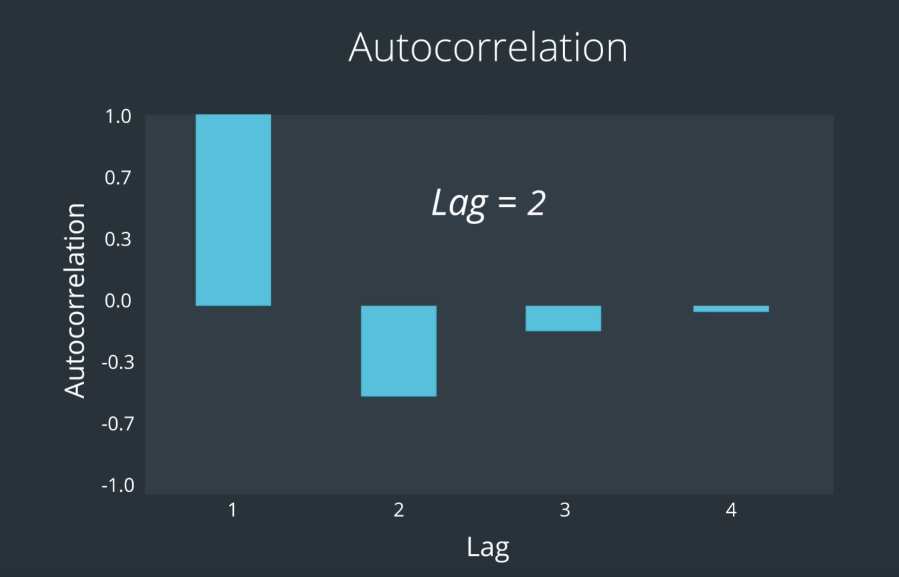

# AI in Trading NanoDegree (AITND)
This repository contains code for Udacity's [AI in Trading NanoDegree](https://www.udacity.com/course/nd880).

## Term I - Quantitative Trading

**Quant**
    - Those who build computational models of the world, that could be about financial markets
    - Apply scientific methods to finance
    - Uses math, statistics and technology to solve business problems (quantitative skills)
    - Work in hedge funds, commercial banks, asset management firms, data vendor firms etc.
    - Across different functions:
        - Research - to capture predictive signals in data to apply downstream to portfolios
        - Risk management
        - Portfolio construction
        - Data vending (preparing unstructured data to sell to financial industry)
        - Sales

### Stock prices

Shares of stock represent fractional ownership in a company, usually a company splits their stock into millions or billions of shares.

Two types of Stock:
- **Common** - shareholders receive a portion of profit as dividends, are able to vote on decisions and receive a portion of the remaining assets in case of liquidation
- **Preferred** - shareholders are promised a fixed amount of income each year, get paid before common stock holders get paid their dividends and usually do not have voting rights

**Capital gain** is the increase in the value of a stock

**Options: calls, puts, American, European**
Options give the owner the right to buy or sell at the strike price (a fixed price that is determined when the option is created), on or before an expiration date. The most common are call options and put options. Call options give the right to buy at the strike price; put options give the owner the right to sell at a fixed price. Some options allow the holder to “exercise” (buy or sell) at the strike price any time up to the expiration date. These are called “American options” by convention, even though this doesn’t mean that the options are traded in the Americas. Another class of options only allows the holder to exercise the option at the expiration date, but not earlier. These are called “European options” by convention, but again, European options don’t necessarily have to be traded in Europe.

**Forwards and Futures**
Futures and forwards contracts are similar, in that a buyer and seller both agree to make a future transaction at a predetermined price. Futures are standardized contracts that can be traded on a futures exchange, so this may be what people think of when discussing “forwards and futures”. Forward contracts are usually privately determined contracts between two parties. So an investor can trade futures contracts, but forward contracts are not designed to be traded like futures.

**Public versus private equity**
Public equity refers to stocks that can be traded on a stock exchange. Private equity refers to ownership in private companies, so the owners of private equity do not trade their shares on a stock exchange. Our course is primarily focused on public equity, which we’ll refer to as stocks, since the ability to buy and sell freely enables us to adjust our investments based on new or time-sensitive information.

**Security** is a financial instrument that has some type of monetary value such as stocks, bonds and options. Can be classified in three types:
    - **Debt**: represent money owed that needs to be paid such as government or corporate bonds or certificates of deposit, promise a fixed stream of income over time in the form of interest
    - **Derivative** - values depend on the prices of other assets such as options and futures contracts. For example an option gives the purchaser the right to but not the obligation to buy or sell the underlying asset at a specific price and date. The futures contract obligates the purchaser to buy or sell.
    - **Equity** - value of an owned asset minus the amount of all debts and liabilities on that asset or `net value`, stocks are equity securities since they represent ownership in a firm, private equity is a security representing interest in a private company

**Brokerage** acts as the middleman between buyers and sellers that will charge fees for transactions.

**Market Bubble** occurs when market participants drive stock prices above their value in relation to some system of valuation.

### Terminology Recap

Stock: An asset that represents ownership in a company. A claim on part of a corporation's assets and earnings. There are two main types, common and preferred.

Share: A single share represents partial ownership of a company relative to the total number of shares in existence.

Common Stock: One main type of stock; entitles the owner to receive dividends and to vote at shareholder meetings.

Preferred Stock: The other main type of stock; generally does not entail voting rights, but entitles the owner to a higher claim on the assets and earnings of a company.

Dividend: A partial distribution of a company's profits to shareholders.

Capital Gains: Profits that result from the sale of an asset at a price higher than the purchase price.

Security: A tradable financial asset.

Debt Security: Money that is owed and must be repaid, like government or corporate bonds, or certificates of deposit. Also called fixed-income securities.

Derivative Security: A financial instrument whereby its value is derived from other assets.

Equity: The value of an owned asset minus the amount of all debts on that asset.

Equity Security: A security that represents fractional ownership in an entity, such as stock.

Option Contract: A contract which gives the buyer the right, but not the obligation, to buy or sell an underlying asset at a specified price on or by a specified date

Futures Contract: A contract that obligates the buyer to buy or the seller to sell an asset at a predetermined price at a specified time in the future

Practice: `stock_data.ipynb`

### Market Mechanics

How to define price? Maximum price a buyer is willing to buy at and minimum price the seller is willing to sell at.

Stock price:

- as soon as it starts trading publicly, price is set given company metrics (revenue, profits, assets)
- after it is driven by **demand**
- how many people want to buy and how much they are willing to par or how many orders are placed and at what price
- markets keep electronic records of it all, limit orders (buy for a max of and sell for a min of), orders are matched according to these limits
- example: I submit a bid for 2 shares of NFLX at \$ 180, someone else submits a sell order of 4 NFLX shares at \$ 179.90, so there is match since the asking price is lower than the buying price. It's like an auction! Stock exchange is the authority.
- the stock exchange keeps track of the last price a specific stock was traded at (current price), someone can then sell at that price immediately (_market order_), the _market maker_ (brokerage) on the other end offers to buy at the same time potentially making profit from trading fees and commissions. The difference between the bid and ask price is known as the `bid-ask spread`
- the market maker brings **liquidity**: the property of a financial asset to be bought or sold without causing sharp changes in its price, also varies according to the market trading it (although differences are usually small). **Arbitrage** is buying and selling in different market to explore market inefficiency (difference in prices). Cash is considered the most liquid asset, because it can be readily traded for other assets.
- Stock exchange publishes **tick data** (data for each individual trade), intuitive to gauge health of a stock
- Important pieces of data: regularize time intervals and summarize data for each interval
    - ex: in 1 minute we capture: `open` `high` `low` `close` or OHLC
- Volume is also tracked - number of stocks traded during a specific time interval and large volumes of net buy orders tend to increase the stock price and large volumes of net sell orders tend to decrease stock price, hedge funds will spread their transactions across days because they alone influence the market by the large volume of their own transactions. Intra-day volume is important
- gaps in market data: 9:30am - 4:00pm operations, in order to also keep an eye for automated trading
- some exchanges allow premarket (4am to 9:30am) and postmarket (4pm to 8pm) trading, volume is typically low
- Note: Pre-market sessions (for the US market) are a period of time where stocks are very thinly traded. Market participants often use this to gauge the strength and direction of the market. Post-market sessions are often used by traders who want to trade on corporate announcements made after market closes, or for brokers to make whole of an incomplete client order.
- Beware of different market timezones.


Practice: `resample_data.ipynb`

### Data Processing

- Time resampling due to otherwise impossible to handle amount of tick data


- Corporate actions: **stock splits** and **dividends**

- **market capitalization** is the dollar value of a company's outstanding shares

$$market \ cap=stock \ price * n_{shares \ outstanding}$$

- you may want to split a share to make it more liquid, more granularity. The stock price then drops and we need to normalize the data appropriately (for instance by doubling the price after a 2:1 split or better yet by halving the price before the 2:1 split so the newest adjusted price matches the market price). Historical datasets provide this _adjusted data_.

Aside: Although a stock split shouldn’t theoretically affect the market cap of a stock, in reality it does! There are some intriguing behavioral patterns that researchers have observed among traders. One seems to suggest that after a stock splits, and the price drops considerably, people seem to think it is going to go back up to the previous price (double or triple)! This creates an artificial demand for the stock, which in turn actually pushes up the price.


- cash **dividends**: partial cash distribution of company earnings. there is a cutoff date by which you have to buy the share to get future dividends on it (`ex-dividend date`). The price is also adjusted based on dividends. We normalize data prior to the ex-dividend date by dividing data by the adjusted price factor where D is the dividend and S is the stock price at ex-dividend date

$$adjusted \ price \ factor = 1+D/S$$

Now we have normalized historical market price data and want to get signals or indicators to trading strategies. What is the expected price of a stock?

One signal might come from the **simple moving average (rolling mean)** of the stock price data. So we can devise a trading strategy that looks at large deviations of these rolling means to generate trading signals. The threshold could be the standard deviation of the rolling window. Usually twice the std is used.


Note: Moving-window or “rolling” statistics are typically calculated with respect to a past period. Therefore, you won’t have a valid value at the beginning of the resulting time series, till you have one complete period. For instance, when you compute the Simple Moving Average with a 1-month or 30-day window, the result is undefined for the first 29 days. This is okay, and smart data analysis libraries like Pandas will mark these with a special “NA” or “nan” value (not zero, because that would be indiscernible from an actual zero value!). Subsequent processing or plotting will interpret those as missing data points.

- Missing days (weekends and holidays) might be worth treating.
    - The NYSE and NASDAQ average about 252 trading days a year. This is from 365.25(days on average per year) * 5/7(proportion work days per week) = 260.89 - 9(holidays) = 251.89 ~ 252.

- Survivor bias
    - Experiment A: Randomly select a smattering of 100 stocks that are trading today, simulate buying them in 2005, or whenever they went public, investing equally in each, and hold on to them till the present day. Don’t try to apply any strategy, just pick stocks randomly!
    - Experiment B: Randomly select another collection of 100 stocks, but this time, from those that were trading in 2005. Again, simulate buying them in 2005, investing uniformly, and hold on to them.
    - The average return from Experiment A would indeed be higher than that from B. this is important when analyzing efficiency of trading strategies using backtesting.

**Fundamental Analysis**
Fundamental analysis of a company involves looking at a company’s balance sheet and cash flow statements, which are usually updated every quarter, which is every three months when the company reports earnings. It’s important to keep in mind that looking at a single quarter’s metrics is only a snapshot of the company, and there are several metrics that each try to capture the health of the company, but in slightly different ways.

In a way, analyzing a company’s fundamentals is like going on a safari taking photographs of an antelope. A single still photo from one angle may tell you some things about the antelope, but taking multiple photos from different angles will give you a better view. Also, taking multiple photos over time will give you a sense of where the antelope is going. So before we introduce some commonly used metrics, please keep in mind that to get a better picture of a company that you’re trying to analyze, you’ll want to look at a collection of different measures over time.

**Sales Per Share**
A company’s revenue is based on its sales over that quarter, so we can think of sales and revenue as referring to the same thing. It’s a quick way to get a sense for how a company is doing, because we don’t have to subtract out cost of sales, which depends a bit on some accounting decisions. For example, if a company sells a million smartphones for a hundred dollars each over the past 3 months, then its revenue is $100 times 1 million, or \$100 million. If the company issued ten million shares, then its sales per share is \$100 million divided by ten million, or $10 per share.

You may be wondering why we bother dividing sales by the number of shares. This helps shareholders get a sense of how much the sales figures might impact a change in a single share price. You can imagine that if the company only issued 10 shares, a report of higher sales than forecasted would impact each share more than if the company issued ten million shares.

Also, note that sales of $10 per share probably does not mean that the shareholders will get $10 for each share that they own, or that their stock price will increase by \$10. It costs money for the company to make each smartphone. Let’s take a look at a metric that accounts for cost of sales next.

**Earnings Per Share
Earnings is the company’s revenue minus its cost of sales. Cost of sales refers to the cost of manufacturing the phone, employee wages, rent payments for office space, and the cost of equipment, like machines that make the phones. Earnings gives investors a sense of how much the equity of the company has changed over the past 3 months. Recall that stock represents a fractional ownership of a company’s equity.

Continuing with the smartphone company example, let’s say we can estimate the cost of sales per phone to be \$80 per phone. If the sales per phone is \$100, then the earnings per phone is \$100 - \$80 equals \$20 per phone. With sales of one million phones, earnings would be \$20 times one million, or \$20 million.

With ten million shares, this is earnings of \$20 million divided by ten million shares, which is \$2 earnings per share.

Note again, that this \$2 per share doesn’t mean that investors automatically receive an additional \$2 per share in their pocket. Let’s look at one way that investors do receive some of those earnings by looking at dividends.

Dividends Per Share
After a company has positive earnings, they may decide to either reinvest the cash in growing the company’s business. A company’s executives are usually expected to make spending decisions based on maximizing shareholder value. Whether this always happens in practice is debatable, but ideally, if the executives decide that re-investing in the business yields lower returns than an investor could gain from investing in a similar business at the same level of risk, they will give some of the earnings to shareholders as cash. This cash is referred to as dividends.

Let’s say, for example, that the smartphone company decides to return $10 million of its earnings to its shareholders. The dividend per share is then \$10 million divided by 10 million, or \$1 per share.

**Price to Earnings Ratio**
A term you’ll see often is price to earnings ratio, or PE ratio for short. This is the stock’s current market price divided by its most recently reported earnings per share (EPS). You can sort of interpret the PE ratio as how much the company is valued compared to how much money it made. It’s important to be careful about how we interpret a high or low PE ratio, because we can’t say whether a PE ratio is good or bad by looking at it in isolation. Let’s first look at where the price comes from. This market price of a share is based on the collective estimates by investors of the company’s current equity plus its future earnings. The future earnings are based on estimates of future cash flow, which are then adjusted to their present-day value, or Present Value (PV). This is getting a bit outside the scope of what you’ll need to know for this course, but the point we want you to remember is that the market price of a stock is based on both its current assets minus liabilities, but also estimates of the company’s future performance.

Now coming back to the PE ratio. What does it mean to have a high PE ratio? A company may have low or negative earnings, but a high stock price. Why do you think that is? You may have heard of certain startups that are valued at billions of dollars, and yet have low earnings. This is because investors expect potential for high earnings growth, based on the trajectory of past earnings growth. This also means that investors are estimating that the high stock price relative to earnings will be justified by high future earnings. On the other hand, it’s also possible that investor optimism towards the company’s future never materializes, in which case the stock may be overpriced.

Note also that a low PE ratio can also be due to different underlying reasons. An example of a company with a low PE ratio may be one that has high and stable earnings, but less expectations for future growth. Since the company may decide that its investors are better off receiving earnings as dividends instead of reinvesting earnings into the business, the earnings will be distributed as cash to shareholders. This also means that the stock price itself represents the value of the company excluding the cash that was already distributed to these shareholders. Again, keep in mind that a low PE ratio can also be a sign of something else. If a company is expected to face pressure from competitors or government regulation that reduce their expectations for future earnings, then investors may pay a lower price for each share, and that could also result in a lower PE ratio.

In practice, you’ll want to see how a company’s PE ratio compares to other similar companies in the same industry and same geographic region.

You’ll see PE ratios again in later lessons, so for now, just remember that it’s one of many ways to take a snapshot of a company’s financial health.

- We want strategies that yield good returns with reduced risk.

- Mutual funds takes money from multiple investors and intermediate the trading for them. They can track performance on specific sectors such as tech, infrastructure, communications etc.

- Exchange traded funds (ETFs) are ones where you buy the shares in the market, they usually have good growth as long as the sector or index they are tracking perform well. They mitigate risk and you don't to pay a broker to invest in each company individually. A popular one is `S&P 500` (500 companies with large market cap in the NYEX or NASDAQ). Their composition change over time. ETF compositional data is another interesting source of information for trading strategies.

### Stock Returns

Percentage return: $r=(p_{t}-p_{t-1})/p_{t-1}$
Log return: $R=ln(p_{t}/p_{t-1})=ln(r+1)$
If r is close to 0, the log return is close to the percentage return.

Rates of Compounding
A statement by a bank that the interest rate on one-year deposits is 4% per year sounds straightforward and unambiguous. In fact, its precise meaning depends on the way the interest rate is measured. For an interest rate statement to be clear, the magnitude and time dependence of the rate of interest, as well as the frequency of compounding, must be clearly stated.

$$p_t=p_{t-1}(1+r/n)^n$$

With more frequent compounding, the value at 1 year increases but then seems to level off. If you assumed that the benefit of compounding more and more frequently had a limit, you would be right! How do we calculate this limit?

$$lim_{n\rightarrow \infty}=e^r$$

Compounding infinitely often is called continuous compounding.

The **continuously compounded annual return** equals $\ln(p_t/p_{t-1})$. But what is this quantity? It’s just the log return! This is why you might hear log returns called continuously compounded returns. The continuously compounded rate of return is additive over time.

Multiplication of many small numbers can result in the problem that the product is smaller than the smallest number representable in computer memory. Sometimes the computation will incorrectly yield the value 0. This is called arithmetic underflow. The use of logarithms can help with this, since it enables the representation of much smaller (and much larger) numbers.

**Returns and the Historical Record**

Let's look at the adjusted closing price of Apple stock (AAPL) from 1980 up until the present.


These plot look almost the same—that's because the returns and log returns for these daily data have very similar values. This is because daily returns are small—the values are close to 0, so the property $\ln(1 + r) \approx r$ applies. But we're interested in the distribution of these values, so let's look at a histogram.


Here we've plotted a histogram of AAPL's log returns from 1980 to the present, and we've overlaid a scaled normal distribution. We can see a few things right away from this plot. First, the values are centered around 0, and in fact look roughly normal. However, the tails of the histogram clearly lie above the tails of the normal distribution. We call these "fat tails".

In general, the normal distribution can be a reasonable approximation for short-term returns and log returns for some applications. However, many analyses have shown that the data do not conform perfectly to a normal distribution, and often deviate significantly in the tails. The significance of this is that the normal distribution predicts fewer extreme events than are actually observed. The conversation about the best model for the distribution of returns has been going on for at least the past century. The best model will depend on exactly what your analysis seeks to achieve.

Practice: `calculate_returns.ipynb`

Normality and Long-Term Investments

Based on historical data, it may be reasonable to consider short-term returns as approximately normally distributed for some purposes. However, even if short-term returns are normally distributed, long-term returns cannot be. If $r_1 = \frac{p_1 - p_0}{p_0}$ and $r_2 = \frac{p_2 - p_1}{p_1}$ are normally distributed, the sum of these, $r_1 + r_2$ would be normally distributed. But the two-period return is not the sum of the one-period returns. The two-period return equals $(1+r_1)(1+r_2)$ which is not normal and becomes noticeably less normal as the product grows over time.

So long-term prices and cumulative returns can be modeled as approximately lognormally distributed because they are products of independently, identically distributed (IID) random variables. On the other hand, log returns sum over time. Therefore, if $R_1 = \ln\left(\frac{p_1}{p_0}\right)$ and $R_2 = \ln\left(\frac{p_2}{p_1}\right)$ are normal, their sum, the two-period log return, is also normal. Even if they are not normal, as long as they are IID, their long-term sum will be approximately normal, thanks to the Central Limit Theorem. This is one reason why using log returns can be convenient for modeling purposes.


So these are some generally accepted reasons that quantitative analysts use log returns:

1. Log returns can be interpreted as continuously compounded returns.
2. Log returns are time-additive. The multi-period log return is simply the sum of single period log returns.
3. The use of log returns prevents security prices from becoming negative in models of security returns.
4. For many purposes, log returns of a security can be reasonably modeled as distributed according to a normal distribution.
5. When returns and log returns are small (their absolute values are much less than 1), their values are approximately equal.
6. Logarithms can help make an algorithm more numerically stable.

### Momentum Trading

**Trading strategy** is a set of rules to determine what stocks to trade, when to trade, and how much money to invest.

**Momentum** is an empirically observed phenomenon that past "winners" tend to continue to outperform other stocks and past "losers" continue to underperform. So it might be a good idea to buy over-performers and sell under-performers, capitalizing in the continuation of their movement.

Portfolio
A portfolio is a collection of investments held and/or managed by an investment company, hedge fund, financial institution or individual.

**Long**
A long (or long position) is the purchase of an asset under the expectation that the price of the asset will rise.

**Short**
A short (or short position) is the selling of an asset under the expectation that the price of the asset will decline. In practice, an investor profits from a short position by borrowing shares from a brokerage firm (agreeing to pay an interest rate as a fee), selling them on the open market, and later buying them back on the open market at a lower price and returning them to the brokerage firm.


Momentum-based trading strategy:


Let's say we have a timeseries of monthly returns and the mean return is 0.53%. How do we know if the trading strategy actually yielded returns that on average are positive or could this positive mean be due random fluctuations?
We can use the t-test to test whether the mean of our sample differs in a statistically significant way from the theoretical expectation.
$$t=\bar x / SE_{\bar x} \ where\ SE_{\bar x}=std/\sqrt n$$

We measure the probability of getting the actual mean if the true mean is zero or the p value. If the p value is small we infer that is unlikely that the true mean is zero. We set a threshold to label our inferences $\alpha%. If $\alpha=0.1$ we are saying that we are ok in rejecting the null hypothesis when the true mean is 0 in 10% of hypothetical uses of this test.


In finance, alpha refers to multiple distinct but somewhat related ideas. The common thread among these definitions is that alpha is the extra value that an investment professional can add to the performance of an investment.

One specific definition of alpha is the extra return that an actively managed fund can deliver, that exceeds the performance of passively investing (buy and hold) in a portfolio of stocks. Another specific definition of alpha, which we’ll primarily focus on in this course, is that of an alpha vector.

An alpha vector is a list of numbers, one for each stock in a portfolio, that gives us a signal as to the relative future performance of these stocks.

**Test Returns for Statistical Significance**

Remember that if the sample mean is $\bar{x}$, and the sample standard deviation, s, equals:

$$s = \sqrt{\frac{1}{n-1}\sum_{i=1}^n{(x_i-\bar{x})}^2}$$

then the standard error, $s_{\bar{x}}$, equals:

$$s_{\bar{x}} = \frac{s}{\sqrt{n}}$$

where n is the number of observations in the sample. Then in the case that we are testing the hypothesis that the population mean, μ, equals 0, the t-statistic, t, equals:

$$t = \frac{\bar{x}-\mu}{s_{\bar{x}}} = \frac{\bar{x}-0}{s_{\bar{x}}} = \frac{\bar{x}}{s_{\bar{x}}}$$

​Note: we use `scipy.stats` as the package to perform statistical analysis here.

```
import pandas as pd
import numpy as np
import scipy.stats as stats

def analyze_returns(net_returns):
    """
    Perform a t-test, with the null hypothesis being that the mean return is zero.

    Parameters
    ----------
    net_returns : Pandas Series
        A Pandas Series for each date

    Returns
    -------
    t_value
        t-statistic from t-test
    p_value
        Corresponding p-value
    """
    # TODO: Perform one-tailed t-test on net_returns
    # Hint: You can use stats.ttest_1samp() to perform the test.
    #       However, this performs a two-tailed t-test.
    #       You'll need to divde the p-value by 2 to get the results of a one-tailed p-value.
    null_hypothesis = 0.0
    t, p = stats.ttest_1samp(net_returns, null_hypothesis)

    return t, p/2
```
Low p-values tell us that if the true mean is 0, we would be unlikely to observe a mean as or more "extreme" than the mean we observed.

Practice: `dtype.ipynb` and `top_and_bottom_performing.ipynb`

### Quant Workflow

It all starts with a specific hypothesis. For instance _stocks that are discussed in the news are likely to go up_ is too vague and ergo does not lead to testable predictions. A improved hypothesis would be _stocks whose name or ticker appears on the landing page of the Wall Street Journal website will increase in price by 1% one day following its appearance_.

Market research is key:
    - news
    - blogs
    - books
    - study known strategies
    - academic papers
    - meetups and conferences


Several types of trading strategies:

1. Single asset like S&P500 index
2. Pairwise - compares relative movements of related tickers (same sector for instance)
3. Cross-sectional or equity statistical arbitrage or equity market neutral investing - compares several stocks to determine which to hold in long and short portfolios to benefit from transient phenomena


4. Alternative-data driven (satellite imagery, social media, geolocation, consumer transaction data etc)

Large hedge funds usually apply 3. and 4. given the capacity to invest lots of capital and different ideas to uncover signals (use hard to find and difficult to work with data).


A trading signal is a general term for any numerical signal that informs a trade. In practice, several alphas or signals are combined in a strategy - the idea of **model stacking / ensembling**.

In finance risk refers to uncertainty or variability on returns.
1. systematic risk - inherent to entire market (inflation, recession, interest rates, GDP)
    - sector specific risk - inherent to sectors (regulation, legislation, material costs)
2. idiosyncratic risk - inherent to specific stocks (labor strike, managerial changes)

### Outliers and Filtering

Fat finger errors - human manual entry or computer bugs
Data may be missing - stock suspension (regulatory reasons before big announcements or big imbalance in buy and sell orders)
Mergers and other announcements may cause real extreme price fluctuations so unadjusted price data may have discontinuities (dividends issue dates, stock splits or other corporate actions) and these need to be factored in when processing data to get adjusted values.
Thinly traded stocks can have large fluctuations when traded and predictability on these is low. These can be excluded from the trading universe to prevent lack of predictability. **Turnover** is the volume * price per share  and is low for infrequently traded tickers. **Stop-loss levels** are for exiting positions avoiding big losses.
Filtering for outliers based on rules, like to catch price changes higher than a certain threshold but this can yield lots of false positives. If you also factor in volume changes accuracy of filter increases.
Large amounts of data, missing values, dealing with false positives.
**Lookahead bias** is when inaccuracy in filling missing data comes from using data that had not been known for the period under analysis. On backtesting missing values should be kept.
If trading strategy is well designed, distribution of returns should be positively skewed. But if this distribution is extremely skewed, that raises suspicions. Q-Q plot compares two distributions.


Robust trading signals by using rolling window that would prevent one-off spike up from generating a buy order. For portfolio level ww can average out movements and base actions on the accumulated signal to reduce the effect of outliers.

### Regression

**Signal to noise ratio** tends to be low in finances which can easily lead to overfitting. This means that when used for prediction the model pays too much attention to aspects that are not useful in prediction. The relationships between variables in the model are also not stationary and hence we need to retrain the model every now and then with recent data.

Some statistical tests used assume normal distribution of data points. If data doesn't actually follow normal distribution, the tests can lead to false positives.


**Probability density function** (PDF) defines a distribution.

$$P(x|D) = p(x)$$

Standard normal distribution:
$$f(x)=\frac{1}{\sqrt{2\pi}}e^{-\frac{x^2}{2}}$$

Normal distribution:
$$f(x|\mu, \sigma^2)=\frac{1}{\sqrt{2\pi \sigma^2}}e^{\frac{-(x-\mu)^2}{2\sigma^2}}$$

Note that for discrete variables, a probability mass function gives a probability for each value. However, for a probability density function, which describes a continuous variable, the probability is defined as the area under the curve within a range (between two points). For a single point, the area under the curve is actually zero, which is why probabilities for continuous variables are defined within a range instead of a single point.

Note: The Standard Normal Distribution is centered on zero (hence μ = 0), and has a standard deviation of 1 (σ = 1).

**Comparing Tests for Normality**

There are some visual ways to check if a distribution is normally distributed or not. Recall that normal distributions are symmetric and do not have fat tails (a more formal term for “fat tails” is kurtosis”). Box-whisker plots helps us visually check if a distribution is symmetric or skewed. A histogram lets us check if a distribution is symmetric/skewed, and if it has fat tails. QQ plots help us compare any two distributions, so they can be used to compare distributions other than the normal distribution. If you plot the actual data’s distribution against a theoretical normal distribution, you can decide if the distributions are the same type if the QQ plot produces a fairly straight line.

There are three hypothesis tests that can be used to decide if a data distribution is normal. These are the Shapiro-Wilk test, D’Agostino-Pearson, and the Kolmogorov-Smirnov test. Each of these produce p-value, and if the p-value is small enough, say 0.05 or less, we can say with a 95% confidence that the data is not normally distributed. Shapiro-Wilk tends to perform better in a broader set of cases compared to the D’Agostino-Pearson test. In part, this is because the D’Agostino-Pearson test is used to look for skewness and kurtosis that do not match a normal distribution, so there are some odd non-normal distributions for which it doesn’t detect non-normality, where the Sharpiro-Wilk would give the correct answer.

The Kolmogorov Smirnov test can be used to compare distributions other than the normal distribution, so it’s similar to the QQ plot in its generality. To do a normality test, we would first rescale the data distribution (subtract the mean and divide by its standard deviation), then compare the rescaled data distribution with the standard normal distribution (which has a mean of zero and standard deviation of 1). In general, the Shapiro-WIlk test tends to be a better test than the Kolmogorov Smirnov test, but not in all cases.

So in summary, if you want to be thorough, you can use all three tests (there are even more tests that we haven’t discussed here). If you only want to use one test, use the Shapiro-Wilk test. For a sanity check, visualize your data distribution with a histogram, box-whisker plot, and/or a QQ plot.


If not symmetric, we say the data is skewed. Stock returns tend to be left skewed (extreme values towards negative values are more frequent).


Practice: `test_normality.ipynb`

**Heteroskedasticity**

Stationary means mean, variance and covariance are stable over time.

One of the assumptions of linear regression is that its input data are homoscedastic (variance is stationary). A visual way to check if the our data is homoscedastic is a scatter plot.

If our data is heteroscedastic, a linear regression estimate of the coefficients may be less accurate (further from the actual value), and we may get a smaller p-value than should be expected, which means we may assume (incorrectly) that we have an accurate estimate of the regression coefficient, and assume that it’s statistically significant when it’s not.

**Breusch-Pagan Test** is used to test for homescedasticity (constant variance over time). If small p value (< 0.05), we conclude the data is heteroscedastic.

In finance, we transform our data to make it data normal and homoscedastic by taking the quotient of returns in different time periods and taking the log of this --> Log returns!

The **Box-Cox transformation** transforms dataset to make it more normally distributed.

$$T(x)=(x^{\lambda}-1)/{\lambda}$$

If $\lambda$ is zero, then the transformation is the natural log.

$$T(x)=ln(x)$$

Note: A monotonic transformation changes values in a dataset but preserves the relative order.

**Linear regression**
- Ordinary least squares
- Residuals (error terms) = actual - predicted. If the residuals follow a normal distribution with a mean of zero and constant standard deviation, then residuals can be considered random. On the other hand, if mean is not zero, we say the model has a bias in its prediction errors.
- **Multiple regression** uses various independent variables to fit the data.
- R-squared as a measure of model accuracy in fitting the data. A value of 1 means all the variation in the dependent variable can be explained by all the variation in the independent variables. The adjusted R-squared lets us find the minimum combination of independent variables that are most relevant to our model.
- The **F-test** checks if our coefficients and intercept are non-zero and therefore meaningful. If p $\leq$ 0.05 then we conclude our parameters are not zero.

**Breusch-Pagan Test for Heteroscedasticity**

The Breusch-Pagan test is one of many tests for homoscedasticity/heteroscedasticity. It takes the residuals from a regression, and checks if they are dependent upon the independent variables that we fed into the regression. The test does this by performing a second regression of the residuals against the independent variables, and checking if the coefficients from that second regression are statistically significant (non-zero). If the coefficients of this second regression are significant, then the residuals depend upon the independent variables. If the residuals depend upon the independent variables, then it means that the variance of the data depends on the independent variables. In other words, the data is likely heteroscedastic. So if the p-value of the Breusch-Pagan test is ≤ 0.05, we can assume with a 95% confidence that the distribution is heteroscedastic (not homoscedastic).

In Python, we can use the `statsmodels.stats.diagnostic.het_breuschpagan(resid, exog_het)` function to test for heteroscedasticity. We input the residuals from the regression of the dependent variable against the independent variables. We also input the independent variables that may affect the variance of the data. The function outputs a p-value.

**Multivariate regression** is when we try to predict more than one dependent variable at a time.

Practice: `regression.ipynb`

**Time Series Modeling**

Data collected over constant time intervals.

We use stock log returns as opposed to prices since it is more stationary and hence more useful in predicting future values from past values.

**Autoregressive model (AR)**

Main principle is that recent past values give insight into predicting future values so we try to fit a linear model of the previous values.

$$y_t=\alpha+B_1y_{t-1}+B_2y_{t-2}+...+\epsilon_t$$

The `lag` is the number of previous values used (AR Lag 1 uses only 1 past day).

**Moving Average (MA)**

$$y_t=\mu+\epsilon_t+\theta_1\epsilon_{t-1}+\theta_2\epsilon_{t-2}+...$$

The residuals represent information that cannot be captured by past data points.

Autocorrelation is a measure of how much one value moves in relation to its previous values (correlation ranges from -1 to 1).

The `lag` is the number of previous residuals used. We select it based on the autocorrelation plot.



**Autoregressive Moving Average (ARMA)**

Uses both AR and MA model capabilities. p and q are the lags for both components.

**Autoregressive Integrated Moving Average (ARIMA)**

Used in pairs trading. Uses time differencing to make the model more stationary or stable. In math therms, stock prices are I(1) whereas log returns are I(0). Use the _Augmented Dickey Fuller test_ to check if time series is stationary. If p > 0.5, we need to take the time difference.

**Seasonal Adjustments using ARIMA (SARIMA)**
Time series data tends to have seasonal patterns. For instance, natural gas prices may increase during winter months, when it’s used for heating homes. Similarly, it may also increase during peak summer months, when natural gas generators are used to produce the extra electricity that is used for air conditioning. Retail sales also has expected increases during the holiday shopping season, such as Black Friday in the US (November), and Singles’ Day in China (also in November).

Stocks may potentially have seasonal patterns as well. One has to do with writing off losses in order to minimize taxes. Funds and individual investors have unrealized capital gains or losses when the stock price increases or decreases from the price at which they bought the stock. Those capital gains or losses become “realized capital gains” or “realized capital losses” when they sell the stock. At the end of the tax year (which may be December, but not necessarily), an investor may decide to sell their underperforming stocks in order to realize capital losses, which may potentially reduce their taxes. Then, at the start of the next tax year, they may buy back the same stocks in order to maintain their original portfolio. This is sometimes referred to as the “January effect.”

Removing seasonal effects can help to make the resulting time series stationary, and therefore more useful when feeding into an autoregressive moving average model.

To remove seasonality, we can take the difference between each data point and another data point one year prior. We’ll refer to this as the “seasonal difference”. For instance, if you have monthly data, take the difference between August 2018 and August 2017, and do the same for the rest of your data. It’s common to take the “first difference” either before or after taking the seasonal difference. If we took the “first difference” from the original time series, this would be taking August 2018 and subtracting July 2018. Next, to take the seasonal difference of the first difference, this would mean taking the difference between (August 2018 - July 2018) and (August 2017 - July 2017).

You can check if the resulting time series is stationary, and if so, run this stationary series through an autoregressive moving average model.

Practice: `autoregression_quiz.ipynb`

**Kalman Filter**

- Single state represents all past information
- Handles noisy data
- Predict and measurement update steps iteratively

One way Kalman Filters are used in trading is for choosing the hedge ratio in pairs trading, a magic number that you can estimate from a model, such as a regression model, based on time series data of two stocks.

Every day when you get another data point, you can run another regression and get an updated estimate for this number. So do you take the most recent number every time? Do you take a moving average? If so, how many days will you average together? Will you give each day the same weight when taking the average?

All of these kinds of decisions are meant to smooth an estimate of a number that is based on noisy data. The Kalman Filter is designed to provide this estimate based on both past information and new observations. So instead of taking a moving average of this estimate, we can use a Kalman Filter.

The Kalman Filter takes the time series of two stocks, and generate its “smoothed” estimate for this magic number at each new time period. Kalman Filters are often used in control systems for vehicles such as cars, planes, rockets, and robots. They’re similar to the application in pairs trading because they take noisy indirect measurements at each new time period in order to estimate state variables (location, direction, speed) of a system.

**Particle Filters**

Natural selection of better performing models, the particles are the models and its parameters are set randomly. Type of genetic algorithm.
These do not assume normal distribution of the data or linear relationships.

**Recurrent Neural Networks**

These are linear regressions working in series and parallel. They also output an intermediate output fed back into the ext prediction and hence the "recurrent" in the name (a way to use past information or "memory").

**Volatility**

- Measure of risk or uncertainty about future returns
- Measure of the spread in log returns distribution or its standard deviation
- Gives a sense of the range of values the log returns are likely to fall into
- Some uses: measuring risk, defining position sizes, alpha factors, pricing options, trading volatility directly


$$\sigma=\sqrt{\frac{1}{n-1}\sum_{i=1}^n(\bar r-r_i)^2}$$

- Depends on time frequency of the stock data used, weekly data will yield larger volatilities than daily, generally annualized is used to compare.

- To annualize volatility (extrapolate different time frequency data to annual) we do $\sigma_{year}=\sqrt{252}\sigma_{day}$ or $\sigma_{year}=\sqrt{12}\sigma_{month}$. This is since we know that for two independent variables the variance of the sum is the sum of the variances and so $\sigma_{year}^2=252\sigma_{day}^2$.

- Rolling window to check volatility variability

```
def calculate_simple_moving_average(rolling_window, close):
    """
    Compute the simple moving average.

    Parameters
    ----------
    rolling_window: int
        Rolling window length
    close : DataFrame
        Close prices for each ticker and date

    Returns
    -------
    simple_moving_average : DataFrame
        Simple moving average for each ticker and date
    """

    return close.rolling(window=rolling_window).mean()
```

- Exponentially weighted moving average, at each observation the weight decreases by the same percentage

$$\sigma_t^2=(r_{t-1}^2+\lambda r_{t-2}^2+\lambda^2 r_{t-3}^2+...+\lambda^{n-1} r_{t-n}^2)/(1+\lambda+\lambda^2+...+\lambda^{n-1})$$

```
def estimate_volatility(prices, l):
    """Create an exponential moving average model of the volatility of a stock
    price, and return the most recent (last) volatility estimate.

    Parameters
    ----------
    prices : pandas.Series
        A series of adjusted closing prices for a stock.

    l : float
        The 'lambda' parameter of the exponential moving average model. Making
        this value smaller will cause the model to weight older terms less
        relative to more recent terms.

    Returns
    -------
    last_vol : float
        The last element of your exponential moving averge volatility model series.

    """

    lret = (np.log(prices) - np.log(prices.shift(1)))**2

    return np.sqrt(lret.ewm(alpha=1-l).mean())[-1]
```

Forecasting volatility tends to be easier than forecasting prices.
**Autoregressive Conditionally Heteroscedastic (ARCH)**
Autoregressive - present value is somehow related to recent past values.
Heteroscedastic - the variable we are trying to model has varying magnitudes of variability at different times
Conditionally - refers to a constraint we place on the model that limits the heteroscedastic property to be conditionally dependent on the previous values of the variable

**GARCH** (Generalized) uses previous values of the variance on the model as well.


What causes volatility anyway?
New info reaching the market, people revise their opinions on the stock prices... But research does not support this conclusion. Volatility is to a large extent caused by trading itself. It is frequently correlated with trading volume.

**Mean reversion strategies** are based on the idea that prices will return to their "running mean"" when they go way up or down are good in high volatility times. Momentum trading might do better at low volatility times.
Volatility tends to be low when market is going up and high when the market is going down. There are volatility indices available for trading like the VIX for S&P500.

**Using volatility to trade equity**


- Mean-reverting strategy - Take a short position on an asset when it appreciates because you think it will depreciate again. Since the stock is less volatile, there is less uncertainty on its fair value so a large deviation is likely accompanied by revertion to normal.

- Another observation is that low volatile stocks tend to perform better than high volatile stocks, contrary to intuition.

- We can also use volatility to normalize momentum signals.

- Position sizing, for instance less shares for more volatile and expensive stocks as below.


**Take-profit** and **stop-loss** are thresholds to automatically sell stocks and take garanteed profit or limit losses.

We can also use rolling min and max to define breakout strategy as an alterantive to Bollinger bands (2 standard deviations up and down).


**Mean reversion**

- mean reverting timeseries is one that tends to move around a constant or mean value
- if a mean reverting stock timeseries deviates too much below the mean, we assume it will revert back to the mean and then we may decide to buy the stock when it's low but it's more common to apply the concept to a pair of stocks that are economically linked
- any divergence between these companies is assumed temporary and therefore we make trading decisions assuming the prices will settle back to the original relationship

- **Drift and volatility** model: drift term (long term average) + volatility term (randomness) explain change in price

$$dp_t=p_t\mu dt+p_t \sigma \epsilon \sqrt{dt}$$

The term is the drift term. This means that if we compare the movements of two stocks, one that’s priced at \$ 2 per share, and another that’s priced at \$ 1000 per share, the series with the larger price per share is expected to drift (change) more in absolute dollar amounts compared to the other stock. The μ term is the expected return of the stock (think average return). Think of the expected return as the expected percent change over a period of time. We usually estimate the expected future return based on historical returns. So if a stock is expected to have a larger percent change per day compared to another, we’d also expect it to drift more (change more) compared to the other stock. This term also includes dt, which is the change in time (how much time has passed). If we watched a stock over a period of day versus over one month, we would expect it to drift more over a month, as more time has passed.

Now let’s look at the volatility term. Think of this as the random, bouncy part of the stock movement. This term includes the stock price, the standard deviation of the stock σ, which is a function of time. This is why this model is a type of stochastic volatility model, because it allows for a non-constant volatility that varies over time. If a stock series has higher volatility, this will result in a larger overall movement in stock price. The $\epsilon$ is a white noise term, which means it’s a random number with a mean of zero and standard deviation of one. The white noise accounts for movements in the stock price that are not accounted for by the model. Finally, there’s the square root of the change in time.

- **Stochastic volatility models** are fundamental building blocks for estimating the price of options (calls, puts, swaps) and also bonds. They attempt to represent the movement of a stock price when the volatility of its movements is random.

- **Pairs Trading**


Note that with pairs trading, we analyze the original stock price series, and do not convert them to returns or log returns. Let’s say stock A is \$ 2 per share, and stock B is \$ 3 per share. If we figured out that we can trade these pairs together, we may go long stock A and short stock B. But how much do we long stock A and short stock B? What if we long 3 shares of stock
A and short 2 shares of stock B? This is nice, because $shares_A * price_A - shares_B * price_B = 0$. Doing pairs trading analysis with the stock price series instead of returns lets us decide how many shares of each stock to long or short, since our goal will be to have the same dollar amount in our long position as in our short position. We want movements in both stocks to cancel each other out.

**Hedge ratio**
 Can be defined as the price ratio (uses most recent price only) or through a regression between prices (uses series of recent prices).

**Spread**
The actual price minus the estimated price based on the second stock's price.

- Time lag is good scenario to look out for in pairs trading.

- To check the ecnonomic link we calculate the spread and check if it is stationary.

- **Cointegration** is using two stocks timeseries to compute one that is stationary. For instance, $spread=y_t-(\alpha + \beta x_t)$ is I(0) and so the original series are cointegrated. $\beta$ is the hedge ratio of the coefficient of cointegration. Note that two stocks might be correlated but not necessarily cointegrated if one moves too much when compared to the other. Cointegration assumes movements are matched in magnitude. The **Engle-Granger test** checks for cointegration between two stocks, that is, it gets the hedge ration from regression and tests if the spread is stationary with Dickey-Fuller test (p > 0.5 means no cointegration).

A way to think about whether two stocks’ time series are cointegrated is to see if some linear combination of their time series forms a stationary series.

- **Augmented Dickey Fuller Test**
To check if two series are cointegrated, we can use the Augmented Dickey Fuller (ADF) Test. First, let’s get some intuition to see what the ADF test is doing. It’s trying to determine if the linear combination of the two series, (which is also a time series) is stationary.

A series is stationary when its mean and covariance are constant, and also when the autocorrelation between one time period and another only depends on the time duration between them, and not the specific point in time of each observation.

If you could represent a series as an AR(1) model $y_t = \beta y_{t-1} + \epsilon_t$, let’s think about what happens if the β is greater than one. We can imagine putting in a value for $y_{t-1}$ to get an estimate for $y_t$; then for the next day, we’ll use that value as $y_{t-1}$ to put into the model and estimate the new $y_t$. We’d end up having a series that trends in one direction, so its mean is not constant, and therefore it is not stationary.

Next, if we had a β equal to one, then $y_t = y_{t-1} + \epsilon_t$. We call this special case a random walk, and it means that the current price is equal to the previous price plus some white noise. Even though the mean of this series is constant, its covariance between one time period and another depends upon the point in time of the observations, so it is also not stationary.

Finally, if we had a β of less than one, then we notice that $y_t$ depends upon less than 100% of the value of its previous value $y_{t-1}$, with some added random noise $\epsilon_t$. The series doesn’t trend in a particular direction. Its variance is also constant, and its covariance between any two data points doesn’t depend on the point in time of the data point. You can think of the series like a bouncing rubber ball that’s being tapped lightly by random raindrops. Without the rain, the bouncing ball would have smaller and smaller bounces, and eventually stop bouncing. With random raindrops falling on the ball, some raindrops would make the ball bounce more, others would make the ball bounce less. So overall, the ball maintains a constant bounce height over time.

So conceptually, the Augmented Dickey Fuller Test is a hypothesis test for which the null hypothesis is that a series is a random walk (its \betaβ is equal to one), and so the null hypothesis assumes that the series is not stationary. The alternate hypothesis is that \betaβ is less than one, and therefore it’s a stationary series. So if the ADF produces a p-value of 0.05 or less, we can say with a 95% confidence level that the series is stationary.

- **Clustering** stocks to find stocks to pairs trade that are not so obvious.

- We have two thresholds, one signaling the spread is much wider than usual and the other signaling the spread is much narrower than usual. If spread widens, _short the spread_: short the asset that has increased, long the asset that has decreased (relatively). If spread narrows, _go long the spread_: short asset that has increased, long the asset that has decreased (relatively). **Buy low and sell high**. Buy when it's on sale and sell when it's overpriced. We calculate the Z score (metric for how many standard deviations the spread is from its historical average) $Z \ score = (x-mean)/std$.


- Note that it’s also possible to extend pairs trading to more than two stocks. We can identify multiple pairs and include these pairs in the same portfolio. We can also analyze stocks that are in the same industry. If we grouped the stocks within the same industry into a virtual portfolio and calculated the return of that industry, this portfolio return would represent the general expected movement of all stocks within the industry. Then, for each individual stock series, we can calculate the spread between its return and the portfolio return. We can assume that stocks within the same industry may revert towards the industry average. So when the spread between the single stock and the industry changes significantly, we can use that as a signal to buy or sell.

- Generalizing the 2-stock pairs trading method
We can extend cointegration from two stocks to three stocks using a method called the Johansen test. First let’s see an example of how this works with two stocks.

The Johansen test gives us coefficients that we can multiply to each of the two stock series, so that a linear combination produces a number, and we can use it the same way we used the spread in the prior pairs trading method.

$$w_1 \times stock_1 + w_2 \times stock_2 = spread$$

In other words, if the first stock series moves up significantly relative to the second stock, we can see this by an increase in the “spread” beyond its historical average. We will assume that the spread will revert down towards its historical average, so we’ll short the first stock that is relatively high, and long the second stock that is relatively low.

So far, this looks pretty much like what you did before, except instead of computing a hedge ratio to multiply to one stock, the Johansen test gives you one coefficient to multiply to each of the two stock series.

Extending to 3 stocks
Now let’s extend this concept to three stocks. If we analyze three stock series with the Johansen, we can determine whether all three stocks together have a cointegrated relationship, and that a linear combination of all three form a stationary series. Note that for the purpose of cointegration trading we use the original price series, and do not convert them to log returns. The Johansen test also lets us decide whether only two series are needed to form a stationary series, but for now, let’s assume that we find a trio of stocks that are cointegrated.

The Johansen gives us three coefficients, one for each stock series. We take the linear combination to get a spread.

$$w_1 \times stock_1 + w_2 \times stock_2 + w_3 \times stock_3 = spread$$

We get the historical average of the spread. Then we check if the spread deviates significantly from that average. For example, let’s say the spread increases significantly. So we check whether each of the three individual series moved up or down significantly to result in the change in spread. We short the series that are relatively high, and long the series that are relatively low. To determine how much to long or short, we again use the weights that are given by the Johansen test (w_1, w_2, w_3).

For example, let’s say the spread has gotten larger. Let’s also pretend that $w_1$ is 0.5, $w_2$ is 0.3, and $w_3$ is -0.1. Notice that the weights do not need to sum to 1. We’ll long or short the number of shares for each stock in these proportions. So for instance, if we traded 5 shares of stock 1, we’ll trade 3 shares of stock 2, and one share of stock 3.

If we notice that stock 1 is higher than normal, stock
2 is lower than normal, and stock 3 is lower than normal, then let’s see whether we long or short a stock, and by how much.

Since stock 1 is higher than usual (relative to the others), we short 5 shares of stock 1 because we expect it should revert by decreasing relative to the others.

Since stock 2 is lower than normal, we long it by 3 shares, because we expect it to revert by increasing relative to the others.

Since stock 3 is lower than normal, so we also long it by 1 share but notice that $w_3$ is a negative number (-0.1). Whenever we see a negative weight, it means we change a buy to a sell, or change a sell to a buy. So we long a -1 shares, which is actually shorting 1 share.

#### Stocks, indices and funds

- Equity = assets - liabilities

**Indices**

- Represent aggregated values of a group of stocks, virtual potfolios and not actual fund that people invest in, may be specific to stock exchange, country, or sector
    - S&P: Standard and Poor’s 500 Index (USA)
    - Dow: Dow Jones Industrial Average (USA)
    - IBOVESPA: Ibovespa Brasil Sao Paulo Stock Exchange Index (Brazil)
    - MERVAL: Buenos Aires Stock Exchange Merval Index (Argentina)
    - NIKKEI: Nikkei 225 Index (Japan) HANG SENG: Hang Seng Composite Index (Hong Kong)
    - FTSE 100: Financial Times Stock Exchange 100 Index (UK)
    - EURO STOXX: EURO STOXX 50 (Europe)
- Professional investment managers may use indices as *benchmarks* against which they can evaluate their own fund’s performance.
- Some indices track only companies with similar market cap (large cap, mid cap, small cap)
- Some indices track either *growth* or *value* types of stocks. **Growth stocks** have high growth in sales or earnings and therefore potential for future growth whereas **Value stocks** tend to be mature in sales or revenue and therefore fewer expectations for future growth.
    - How to define if a company is growth or value:
        - Price to earnings ratio: the stock price divided by the company’s earnings per share over the past four quarters.
        - Price to sales ratio: the the stock price divided by the sales per share over the past four quarters.
        - Price to book ratio: the stock price divided by the book value per share. The book value is the company’s accounting value, which is assets minus liabilities.

    - Growth stocks tend to have high price to earnings, price to sales, and price to book ratios.
    - Value stocks tend to have lower price to earnings, price to sales, and price to book ratios.
- Indices are created as subsets of other indices. One way of creating subsets include categorizing by market cap, and then value vs. growth. This is how Standard and Poor’s breaks down some of its indices:
    - S&P 500 Growth & S&P 500 Value
    - S&P MidCap 400 Growth & S&P MidCap 400 Value
    - S&P SmallCap 600 Growth & S&P SmallCap 600 Value
- **Market cap weighting**: Add up all the prices, weighted by the market cap. S&P 500 and IBovespa are some examples.
- If one is added or deleted, the index needs to be rebalanced (weights need to be recalculated). Rebalcing also happens periodically or on day of a major event (merger, acquisition, bankrupcy or privatization).
- To update the index value from one day to the next, we multiply the previous day's index value by the market cap change.
    - A market cap weighted index has only two stocks, A and B. On day 1, the index has a value of 100. Stock A has a market cap of \$ 100 million, while stock B has a market cap of \$ 200 million. One month later, stock A has a market cap of \$ 105 million, while stock B has a market cap of \$ 210 million. What is the value of the index? Answer: $100*315/300=105$
- **Free float**: number of shares that are liquid and tradable on the stock exchange. These may be considered a better measure when calculating market cap because only free float shares can be bought or sold, which means only the trade of free float shares affects the market movement of the stock. The Hang Seng is a capped free float adjusted market cap weighted index.
- **Capped index**: an index that tries to keep large companies from dominating the index is called a capped index, because it sets a maximum weight that can be assigned to a single company. In the case of the Hang Seng Index, the largest allowed weight assigned to any single company is 15%.

**Funds**

- Professionally managed porfolio of investor money.
- Benefit from **diversification** and improve risk versus return (Sharpe ratio), the investor would get the same return but for a lower risk.
- **Actively** Managed Fund: seeks to outperform its benchmark (such as an index). **Alpha funds**. Seeks to generate returns above market.
- **Passively** Managed Fund: seeks to track its benchmark (such as an index). It's oftern referred to as index funds. **Beta funds**. Seeks to match market returns.
- **Smart beta** funds combine active and passive management, nudge weights after an initial period to get better returns. Uses same stocks from an index but with different weighting scheme other than market cap weighting. Originally referred to fundamental weighting that uses accounting measures such as book value. Designed to overweight stocks that may generate better outcomes. An alternaitve smart beta uses square root of market cap to reduce impact of large stocks.
- **Mututal funds** - everyday investors, usually long only (restrictions on derivatives and shorting stocks, so buy and hold stocks expected to perform well in the future), no lockup period (can put and pull money on any business day).
- **Hedge funds** - fewer restrictions on trading strategies (long or short, options and futures), investors are high net worth individuals or institutions such as pension funds, high minimum investment and lockup periods. Use _hedhing strategies_ to reduce risk exposure.
- Relative vs absolute returns
    - relative to benchmark's return (usually an index). for active we talk about _active returns_ and for passive _tracking error_.
    - Annualized tracking error computation: $TE=\sqrt 252*std(return_{portfolio}-return_{benchmark})$
    - absolute returns is usually used to evaluate hedge funds, refer to a fund’s goal to target a certain return regardless of how the market performs.
- Hedging strategies attempt to give market neutral returns. **Hedging** means entering into a transaction in order to reduce exposure to price fluctuations. This is done by buying derivatives. For example, buy put options of a share for \$ 60 and if price drops to $ 50 buy and exercise the put option, making \$ 10 as profit and reducing the exposure to this loss if the stocks were purchased directly.
- (**Assets Under Management** - expenses) / number of shares = **Net Asset Value**
- **Gross expense ratio** = expenses/AUM and **Net expense ratio** = (expenses-discounts)/AUM
- **Open End Mutual Funds** - most mutual funds, allow new investments after the fund starts operations, allow investors to redeem their shares in the fund. Open end funds may keep some of the assets under management as cash, to improve liquidity and handle redemptions. The total return of the fund is a weighted average of the portfolio return and the interest earned from the cash. The total return of an open end fund is a weighted average of its portfolio return and the return on its cash holdings.
- **Closed End Funds** - accept investors at the start of the fund, and do not take new investments nor handle redemptions afterward. This means that the closed end fund does not need to keep cash for liquidity purposes or to handle redemptions. Investors who wish to stop investing in the fund may sell their shares to other investors on a stock exchange, the same way they would sell stocks. Market price of shares may trade at a premium or discount to the Net asset value.
- Transaction Costs - costs from buying or selling (trading) stocks or other assets. The main type of transaction cost for institutional investors (mutual funds, hedge funds) are the costs of moving the market price from large trades. Let’s say a buy-side fund wishes to sell a large number of shares of a particular stock. If they went to a sell-side market maker (an investment bank), the market maker may initially buy at a competitive price, but may ask for a cheaper price to buy more and more of the stock that the fund wishes to sell. Why is this? Well, the market maker’s job is to always be ready to buy, or always be ready to sell. So the market maker wants to be compensated with a cheaper price for taking on more risk of buying all stocks that the fund wishes to unload. From the buy side fund’s perspective, this cheaper price is a transaction cost.

Transaction costs may be difficult to estimate until trading takes place, so a way to compare how costly a strategy may be is by checking how often the fund needs to make a trade. If a strategy requires trading every day as daily data is updated, this may incur more transaction costs compared to a strategy that requires trading once every three months.

#### ETFs (Exchange Traded Funds)

- Firstly created in 1990 in Toronto, 4.5 trillion USD invested today
- Lower fees and operational costs due to passive investment management and fewer transations, lower tax costs
- Open end mutual funds have lower peformance since they need to keep some assets as cash to handle withdrawals. The fund price is also determined by the closing price.
- Closed-end mutual funds have share prices that diverge from the fair value of the portfolio.
- ETFs are tradeable like stocks and their share prices closely follow their fair value.
- ETFs make it easier to invest in commodities and international stocks
- Commodities futures - you can close, roll over or else buy the asset. Futures contract are standardized agreements between two parties to trade an asset at a future date, at a predetermined price. The participant who agrees to buy is “long” the future. The participant who agrees to sell is “short” the future.
- Commodity ETFs -Investors who wish to gain exposure to commodities may buy futures contracts, but this requires them to roll over their positions regularly. Rolling over a futures contracts involves closing out the existing position before its due date and then taking a new position that is due at a later date. Commodity ETFs handle this, so investors could more easily buy and hold shares in a commodity ETF and not worry about rolling over individual futures contracts.
- International ETFs - If investors wish to trade international stocks, these stocks would be listed on a stock exchange of another country, and may be in a different time zone. This means that trading is done during the stock exchange’s open hours, which may not be as convenient for the investor. International ETFs are traded on a local stock exchange, while they are still linked to the stocks that are listed abroad. So investors can trade international ETFs during the open hours of their local stock exchange.
- Hedging with ETFs - Hedge funds use ETFs for hedging purposes. They may construct a portfolio that optimizes their exposure to certain stocks that they believe will perform well, and in order to cancel out general market movements, they may also short an ETF that contains a similar set of stocks. They may also short sector-specific ETFs if they wish to have a neutral exposure to those sectors.
- ETF Sponsors - ETF Sponsors are the financial institutions that issue ETFs. We can think of them as most similar to the fund managers of mutual funds, because they design a portfolio and issue ETF shares. ETF Sponsors may generally charge lower fees compared to other types of funds, in part because of some efficiencies that make it cheaper to run the fund. They earn fees as percentage of AUM.
- **Authorized Participants** - Authorized Participants (APs) and ETF Sponsors partner together to make the ETF system work. We can think of APs as the intermediaries between investors and the ETF Sponsor. Unlike mutual funds or hedge funds, ETF Sponsors don’t take cash to invest, nor do they deal directly with investors. ETF Sponsors take a portfolio of stocks instead of cash, and they trade with APs instead of with investors. ETF Sponsors and APs create ETF shares with the **create process**.
    - The Authorized Participant buys stocks and bundles them in the same proportions as defined by the ETF Sponsor.
    - The AP gives these stocks to the ETF Sponsor.
    - The ETF Sponsor creates ETF shares and gives these to the AP.
    - The AP sells the ETF shares to investors.
- When individual investors wish to divest their holdings in an ETF, they can sell their shares to other investors on the stock exchange, like they would with a stock. This is the same process for investors of closed end mutual funds. To exchange ETF shares for their underlying stocks, this requires what’s called the **redeem process**, and is a transaction between ETF Sponsor and APs. The redeem process takes ETF shares out of circulation, and puts the underlying stocks back into the market.
    - The AP buys ETF shares from investors in the stock market.
    - The AP trades these ETF shares with the ETF Sponsor in exchange for the original stocks.
    - The AP sells these stocks on the stock exchange.
- Operational Costs and Taxes
ETF sponsors can charge more competitive (lower) fees in part because their transactions can be more tax efficient. If you think of how individual investors are taxed on their investments, selling a stock at a higher price than when they bought it will be considered a “realized” capital gain. Investors pay taxes on the cash they earn from capital gains. For an ETF Sponsor, recall that when it enters a create or redeem process, stocks and ETF shares are being exchanged, and not cash. Also, the dollar value of these assets being exchanged are more or less equal. Let’s say an open-end mutual fund is handling investor redemptions, and so the fund sells \$ 10,000 worth of stocks to improve liquidity and handle the redemptions. The fund originally bought those stocks at a value of \$ 9,000, and so realizes a capital gain of \$ 1,000, which is taxed. Let’s also pretend that an ETF sponsor is entering a redeem process with an AP, and gives $10,000 worth of stocks to the AP, in exchange for \$ 10,000 worth of ETF shares. There is no realized capital gain, so there is no tax.
- **Arbitrage** is the act of simultaneously buying and selling assets that are interchangeable, in order to profit from pricing differences. Arbitrage plays a role in making markets more efficient, which means that prices are more consistent for the same asset. When investors and funds collectively find and act on arbitrage opportunities, they reduce price discrepancies in the market.
- Misaligned ETF prices and Arbitrage Opportunity - The market value of an ETF share may diverge from the market value of its underlying portfolio of stocks (its NAV).
    - If an ETF share price is higher than its NAV, we say it’s trading at a premium.
    - If an ETF share price is lower than its NAV, we say it’s trading at a discount.
    - The difference between the ETF share price and its NAV can be called its “basis”.
    - Re-align ETF Share Price with Arbitrage - An Authorized Participant (AP) looks for when an ETF is trading at a premium or discount to its NAV. The AP then buys low and sells high in order to make a profit on the difference. This trade also reduces the price discrepancy and helps to keep ETF share prices in line with their NAV. For example, if the ETF is trading at a premium the AP will enter a create process with the ETF Sponsor. This means that the AP buys the underlying stocks (at a relatively low price) and exchanges them with the ETF Sponsor for ETF shares (which are priced at a premium). Then the AP sells those ETF shares on the stock exchange. The purchase of underlying stocks tends to push the stock prices up. The creation of more ETF shares tends to push the ETF share price downward.

#### Portfolio Risk and Return

- **Idiosyncratic risk or Specific risk** - risks specific to individual companies
- Risk cannot lowered indefinetely with more and more diversification because companies are subjected to **systematic or market risks** like inflation, recession or change in interest rates or GDP.
- **Portfolio mean**
$$E(r_P)=\sum_1^n p(i)r(i)=x_AE(r_A)+x_bE(r_B)$$
- **Portfolio Variance**
$$\sigma_P^2=\sum_i p(i)[r_P-E(r_p)]^2=x_A^2\sigma_A^2+x_B^2\sigma_B^2+2x_Ax_BCov(r_A,r_B)$$
$$Cov(r_A,r_B)=\rho x_Ax_B \sigma_A \sigma_B$$
where $\rho$ is the correlation coefficient and ranges from -1 to 1.
If correlation is -1, then the portfolio would have null variance if $x_a=\sigma_B/(\sigma_a+\sigma_B)$ but in practice systematic risk makes it impossible to perfect anti-correlation.

We just noted that when the correlation is less than one (ρ<1), the portfolio standard deviation is less than the weighted average of the individual standard deviations. The nice benefit of putting two stocks into a portfolio is that, as long as they’re not perfectly correlated, we’ll end up with a portfolio whose risk is less than the the weighted sum of the individual risks. A key benefit of portfolio diversification is that it helps us to reduce risk!

**The Covariance Matrix**

We can write the portfolio variance in vectorial form as:
$$\sigma_P=x^TPx$$
where P is the covariance matrix


We know that
$$Cov(r_A,r_b)=E[(r_A-\bar r_A)(r_B-\bar r_B)]=\frac{1}{n-1}\sum_{i=1}^n (r_{Ai}-\bar r_{A})(r_{Bi}-\bar r_{B})$$

If each vector has a mean of 0 the covariance matrix can be calculated as
$$1/(n-1)r_A^Tr_B=1/(n-1)r^Tr$$
where r has each vector observations as its columns

**The Efficient Frontier**


The efficient frontier for a given set of stocks gives us the set of portfolios that achieve the highest return for each level of risk. The efficient frontier also contains the set of portfolios that achieve the lowest level of risk for each level of return. We refer to these portfolios along the efficient frontier as market portfolios. As portfolio managers, we would be interested in finding the weights for each stock that create these market portfolios on the efficient frontier.

The minimum variance portfolio is a single portfolio in the efficient frontier that has the lowest risk.


**Capital Market Line**

A risk-free asset provides a guaranteed rate of return with no uncertainty.
We can do better than the efficient frontier by adding a risk-free asset into the portfolio. The capital market line gives us potential portfolios with better returns at the same level of risk than the efficient frontier. It is tangent to the efficient frontier passing through the risk-free asset as below.


The **Sharpe ratio** is the slope of the capital market return or the ratio of reward to volatility.
$$(\bar r_M-r_f)/\sigma_M$$

The numerator of the Sharpe ratio is called the excess return, differential return as well as the risk premium. It’s called “excess return” because this is the return in excess of the risk-free rate. It’s also called the “risk premium”, because this represents the premium that investors should be rewarded with for taking on risk.
The denominator is the volatility of the excess return.

The Sharpe Ratio allows us to compare stocks of different returns because the Sharpe ratio adjusts the returns by their level of risk.
To convert the Sharpe ratio from daily to annual we multiply by $\sqrt 252$.
Also if you borrow (or short) the risk-free asset, even bigger returns can be achieved.


Treasury securities are IOUs from a government. They are government debt instruments used to finance government spending as an alternative to taxation. In the case of stable governments, they are considered relatively risk-free. In the U.S., Treasury bills mature in 1 year or less, Treasury notes mature in 2 to 10 years, and Treasury bonds mature in 20 to 30 years.

**Other Risk Measures**
There are other ways to measure risk besides standard deviation. Two other common risk measures are semi-deviation and Value-at-Risk (written as VaR).

**Semi-Deviation**

If you were given two stocks, one that continued to increase by 10% every day, and one that decreased by 10% every day, would you intuitively think that one stock was more risky than the other? Standard deviation measures of risk would give these two stocks the same level of risk, but you might think that investors are more worried about down-side risk (when stocks decline), rather than upside risk. The motivation for semi-deviation measure of risk is to measure downside risk specifically, rather than any kind of volatility.

Semi-deviation is calculated in a similar way as standard deviation, except it only includes observations that are less than the mean.

$$SemiDeviation = \sum_{t=1}^{n}(\mu - r_i)^2 \times I_{r_i<\mu}$$
​
where $I_{r_i < \mu}$ equals 1 when $r_i < \mu$ and 0 otherwise.

**Value-at-Risk** is defined as the maximum dollar amount expected to be lost over a given time horizon at a predefined confidence level. For example, if the 95% one month VaR is \$ 1 million, there is 95% confidence that the portfolio will not lose more than \$ 1 million next month. Another way to describe the VaR is that there is a 5% chance of losing \$ 1 million or more next month. The methods for calculating VaR are beyond the scope of this lesson, but if you ever become a risk manager, or ever work with a risk manager, you’ll probably see Value-at-Risk quite a bit.

For a visual representation of VaR, we can look at a data distribution that represents the rate of return of a stock. If we color in the area in the left tail that represents 5% of the distribution, the rate of return represented by that point on the horizontal axis is the rate of return that may occur in the 5% worst case scenario. To convert that to a VaR, we multiply that rate of return by the amount of capital that is exposed to risk. For a portfolio, it would be the amount of dollars invested in that particular stock.

**Capital Asset Pricing Model**

The CAPM is a model that describes the relationship between systematic risk and expected return for assets. The CAPM assumes that the excess return of a stock is determined by the market return and the stock’s relationship with the market’s movement. It is the foundation of the more advanced multi-factor models used by portfolio managers for portfolio construction.

Ok, let’s quickly recap: the systematic risk, or market risk, is undiversifiable risk that’s inherent to the entire market. In contrast, the idiosyncratic risk is the asset-specific risk.

Ok, let’s take a look at CAPM. For a stock, the return of stock ii equals the return of the risk free asset plus β times the difference between the market return and the risk free return. β equals the covariance of stock ii and the market divided by the variance of the market.

$$r_i-r_f=\beta(r_m-r_f)$$

β describes which direction and by how much a stock or portfolio moves relative to the market. For example, if a stock has a β of 1, this indicates that if the market’s excess return is 5%, the stock’s excess return would also be 5%. If a stock has a β of 1.1, this indicates that if the market’s excess return is 5%, the stock’s excess return would be 1.1 × 5%, or 5.5%.

Generally speaking, investors need to be compensated in two ways: time value of money and risk. The time value of money is represented by the risk free return. This is the compensation to investors for putting down investments over a period of time. $\beta (r_m - r_f)$ represents the risk exposure to the market. It is the additional excess return the investor would require for taking on the given market exposure, β. $r_m- r_f$ is the risk premium, and β reflects the exposure of an asset to the overall market risk.

**Security Market Line**

The Security Market Line is the graphical representation of CAPM and it represents the relation between the risk and return of stocks. Please note that it is different from the capital market line. The y-axis is expected returns but the x-axis is beta. (You may recall that for the capital market line that we learned earlier, the x-axis was standard deviation of a portfolio.) As beta increases, the level of risk increases. Hence, the investors demand higher returns to compensate risk.

The Security Market Line is commonly used to evaluate if a stock should be included in a portfolio. At time points when the stock is above the security market line, it is considered “undervalued” because the stock offers a greater return against its systematic risk. In contrast, when the stock is below the line, it is considered overvalued because the expected return does not overcome the inherent risk.
The SML is also used to compare similar securities with approximately similar returns or similar risks.

#### Portfolio Optimization

If the first-order partial derivatives are 0 at the point (a,b):

- If $det(H)(a,b)>0$ and $f_{xx}(a,b)>0$ then (a,b) is a local minimum of f.
- If $det(H)(a,b)>0$ and $f_{xx}(a,b)<0$ then (a,b) is a local maximum of f.
- If $det(H)(a,b)<0$ then (a,b) is a saddle point.
- If $det(H)(a,b)=0$ then (a,b) then the second derivative test is inconclusive, and the point (a, b)(a,b) could be any of a minimum, maximum or saddle point.

where H is the Hessian matrix or the matrix of the second-order partial derivatives.

Convex optimization problems (objective function is convex, inequality constraints are convex and equality constraints are of the form $f(x)=a^Tx+b$) only have one minimum.

For a portfolio with two stocks only the minimization of the portfolio variance has an analytical solution:
$$x_A=\frac{\sigma_B^2-\sigma_A \sigma_B \rho_{r_Ar_B}}{\sigma_A^2+ \sigma_B^2-2\sigma_A \sigma_B \rho_{r_Ar_B}}$$

So far, we've discussed one way to formulate a portfolio optimization problem. We learned to set the portfolio variance as the objective function, while imposing the constraint that the portfolio weights should sum to 1. However, in practice you may frame the problem a little differently. Let's talk about some of the different ways to set up a portfolio optimization problem.

There are several common constraints that show up in these problems. Earlier, we were allowing our portfolio weights to be negative or positive, as long as they summed to 1. If a weight turned out to be negative, we would consider the absolute value of that number to be the size of the short position to take on that asset. If your strategy does not allow you to take short positions, your portfolio weights will all need to be positive numbers. In order to enforce this in the optimization problem, you would add the constraint that every $x_i$ in the x vector is positive.

You may choose to impose constraints that would limit your portfolio allocations in individual sectors, such as technology or energy. You could do this by limiting the sum of weights for assets in each sector.

If your optimization objective seeks to minimize portfolio variance, you might also incorporate into the problem a goal for the total portfolio return. You can do this by adding a constraint on the portfolio return.
$$x^T \mu \ge r_min$$

We can also flip the problem around by maximizing returns instead of minimizing variance. Instead of minimizing variance, it often makes sense to impose a constraint on the variance in order to manage risk. Then you could maximize mean returns, which is equivalent to minimizing the negative mean returns. This makes sense when your employer has told you, “I want the best return possible, but you must limit your losses to p percent!”
$$objective: minimize: -x^T\mu$$
$$constraint: x^TPx \le p$$

You could also create an objective function that both maximizes returns and minimizes variance, and controls the tradeoff between the two goals with a parameter, bb. In this case, you have two terms in your objective function, one representing the portfolio mean, and one representing the portfolio variance, and the variance term is multiplied by bb.

How does one determine the parameter bb? Well, it’s very dependent on the individual and the situation, and depends on the level of risk aversion appropriate. It basically represents how much percent return you are willing to give up for each unit of variance you take on.

$$objective: minimize: -x^T\mu+bx^TPx, b \ tradeoff \ parameter$$

Minimizing Distance to a Set of Target Weights

One way to formulate an optimization problem is to use the L2 norm and minimize the difference between your vector of portfolio weights and a set of predefined target portfolio weights x*. The goal would be to get the weights as close as possible to the set of target weights while respecting a set of constraints. As an example, these target weights might be values thought to be proportional to future returns for each asset, in other words, an alpha vector.

$$objective: minimize: ||x-x*||_2, x* \ set \ of \ target \ portfolio \ weights$$

What if you want to minimize portfolio variance, but have the portfolio track an index at the same time? In this case, you would want terms in your objective function representing both portfolio variance and the relationship between your portfolio weights and the index weights, q. There are a few ways to set this up, but one intuitive way is to simply minimize the difference between your portfolio weights and the weights on the assets in the index, and minimize portfolio variance at the same time. The tradeoff between these goals would be determined by a parameter, λ.

$$objective: minimize: x^TPx+\lambda ||x-q||_2, q \ set \ of \ index \ weights, \lambda \ tradeoff \ parameter$$

What is cvxpy? cvxpy is a Python package for solving convex optimization problems. It allows you to express the problem in a human-readable way, calls a solver, and unpacks the results.

How to use cvxpy
Import: First, you need to import the package: `import cvxpy as cvx`

Steps: Optimization problems involve finding the values of a variable that minimize an objective function under a set of constraints on the range of possible values the variable can take. So we need to use cvxpy to declare the variable, objective function and constraints, and then solve the problem.

Optimization variable: Use `cvx.Variable()` to declare an optimization variable. For portfolio optimization, this will be x, the vector of weights on the assets. Use the argument to declare the size of the variable; e.g. `x = cvx.Variable(2)` declares that x is a vector of length 2. In general, variables can be scalars, vectors, or matrices.

Objective function: Use `cvx.Minimize()` to declare the objective function. For example, if the objective function is `(x - y)^2`, you would declare it to be: `objective = cvx.Minimize((x - y)**2)`.

Constraints: You must specify the problem constraints with a list of expressions. For example, if the constraints are x + y = 1 and x - y ≥ 1 you would create the list: constraints = `[x + y == 1, x - y >= 1]`. Equality and inequality constraints are elementwise, whether they involve scalars, vectors, or matrices. For example, together the constraints 0 <= x and x <= 1 mean that every entry of \mathbf{x}x is between 0 and 1. You cannot construct inequalities with < and >. Strict inequalities don’t make sense in a real world setting. Also, you cannot chain constraints together, e.g., 0 <= x <= 1 or x == y == 2.

Quadratic form: Use `cvx.quad_form()` to create a quadratic form. For example, if you want to minimize portfolio variance, and you have a covariance matrix P, the quantity `cvx.quad_form(x, P)` represents the quadratic form x^TPx, the portfolio variance.

Norm: Use `cvx.norm()` to create a norm term. For example, to minimize the distance between x and another vector, create a term in the objective function `cvx.norm(x-b, 2)`. The second argument specifies the type of norm; for an L2-norm, use the argument 2.

Constants: Constants are the quantities in objective or constraint expressions that are not Variables. You can use your numeric library of choice to construct matrix and vector constants. For instance, if x is a cvxpy Variable in the expression A*x + b, A and b could be Numpy ndarrays, Numpy matrices, or SciPy sparse matrices. A and b could even be different types.

Optimization problem: The core step in using cvxpy to solve an optimization problem is to specify the problem. Remember that an optimization problem involves minimizing an objective function, under some constraints, so to specify the problem, you need both of these. Use `cvx.Problem()` to declare the optimization problem. For example, `problem = cvx.Problem(objective, constraints)`, where objective and constraints are quantities you've defined earlier. Problems are immutable. This means that you cannot modify a problem’s objective or constraints after you have created it. If you find yourself wanting to add a constraint to an existing problem, you should instead create a new problem.

Solve: Use `problem.solve()` to run the optimization solver.

Status: Use `problem.status` to access the status of the problem and check whether it has been determined to be unfeasible or unbounded.

Results: Use `problem.value` to access the optimal value of the objective function. Use e.g. `x.value` to access the optimal value of the optimization variable.

Rebalancing to bring weights back to targets. **Target asset allocation** = some goal you have for the weights on the assets in your portfolio. Can be done at a predetermined temporal frequency or when weights drift by a certain percentage from the targets or even a combination of both. Costs: transaction costs, taxes, time and labor costs.

#### Factors

**Alpha factors** - drivers of mean returns
**Risk factors** - drivers of volatility

Factors can be based on: momentum, fundamental information, signals from social media...

**Factor** is a list of numerical values, one for each stock, potentially predictive of an aspect of the performance of these stocks in the future.
Basis of quantitative portfolio management. Signals where to place bets and how much to place.

Example of a factor: a momentum one
Hypothesis: one-year return indicates momentum for the next few days. So the factor is the one-year return of each stock in the universe.

We use the factor value to determine portfolio weights for the stocks as opposed to predicting future prices of each stock.


**Standardized factor**

- Sum of values equals zero - we de-mean the factors
- Sum of absolute values equals one - we rescale the factors by didiving them by the sum of the absolute values


The de-meaning aims to make the portfolio **dollar neutral**, i.e. dollars short = dollars long to test the predictive power of the factor and at the same time excluding the influence of the overall market movement (**market neutral**).

A portfolio's notional is the number we can multiply the stock weights by in order to get a dollar value for each stock's position. For a long-only portfolio, we can think of this as the amount of cash that a fund has available to invest in the portfolio. Whether the positions are long or short, we can multiply the stock weight to the notional to turn this into a dollar amount for that stock's position.

We also call the dollar neutral portfolios **zero-investment portfolios** as there would be no net cash invested. But in real life, there are transaction costs etc but let's not worry about that for the theoretical portfolio.

- How to convert a portfolio to be dollar neutral?

We shift our weights while keeping the relative difference, or we de-mean it.


- Why do we rescale the factor?

To make the portfolio leverage ratio equal to 1.

Leverage is the act of borrowing in order to invest. Borrowing cash in order to go long on more positions may magnify gains but also losses. We can borrow cash or short stocks.

Using leverage to double initial investment, a 10% increase in stock price would mean a 20% increase over initial capital.

The **leverage ratio** is the sum of the magnitudes of all positions, divided by the notional. The leverage ratio gives a sense of how much risk a portfolio is taking, because taking more positions magnifies both gains and losses. To standardize a factor, we divide by the sum of the magnitudes (sum of the absolute value of the positions), so that this rescaled vector's sum of magnitudes is equal to one. This makes different factors more comparable, because it's as if you're comparing different portfolios but each with the same amount of money placed on their positions.


After standardization, the sum of the demeaned weights is always zero, the sum of the rescaled weights is always zero, the sum of the absolute value of the rescaled weights is always one, the sum of the rescaled short positions is always -0.5.

**Zipline Pipeline**

Zipline is an open-source algorithmic trading simulator and it's used to filter stock data according to factors. A pipeline is a placeholder for a series of data operations used to filter and rank data according to some factor(s).

### Factor Models

- Statistical model to describe variability among observed correlated variables in terms of potentially smaller number of unobserved variables (factors).

- The so-called **latent variables** explain correlations in the set of variables of interest.

- In finance, we want to model the asset returns. Factor models attempt to model the return of a large group of stocks that are somewhat correlated with a smaller set of variables which explain their common variability. A linear combination of the _factors returns_ plus an error term model the observed returns. Each stock has a set of "exposures" to the different factors and an error (unexplained term).


The influence of our factor returns cannot be measured directly, that's what we call unobserved or latent random variables. And so, we need other steps to produce the timeseries before we run the multiple regression!

How to measure these factors?
- Example: we hypothesize that stock returns is related to its size of the company (market cap), smaller sized companies could produce larger returns.

To create a single timeseries of factor return, we create a theoretical portfolio apllying out hypothesis (longs small caps and shorts large caps) to construct it and the factors will be its daily returns.

The terminology used to describe factor models varies widely. Here are some common phrases used to refer to the components of the model.

Factor returns may be:

- macro-economic variables
- returns on pre-specified portfolios,
- returns on zero-investment strategies (long and short positions of equal value) giving maximum exposure to fundamental or macro-economic factors,
- returns on benchmark portfolios representing asset classes,
- or something else.

The b_ij coefficients may be called:

- factor exposures,
- factor sensitivities,
- factor loadings,
- factor betas,
- asset exposures
- style
- or something else.

The s_i term may be called:

- idiosyncratic return,
- security-specific return,
- non-factor return,
- residual return,
- selection return
- or something else.

- Factor model assumptions: 1) the residual of returns is not correlated to the factor returns and 2) the residuals for different assets are not correlated. Then only exposures to the factors give rise to correlations among assets returns. The residual for a specific asset is said to be specific or "idiosyncratic" to that asset.


- Covariance matrix using a factor model

If we demean the returns, this will be $E[rr^T]$. We know that $r=Bf+s$.


How are factor models used?

The final exposure will be the multiplication of the factor exposure to the weight of the asset. If we have risk and alpha factors in our model and want to limit the exposure to risk factors we can pose constraints in the final exposure (B*x). We don't constrain the alpha factors which are drivers of mean returns. So we can drop them from B and consider B the risk factor loading matrix only! And so we only include the risk factors in F. All other variance is accounted for in S. The alpha factors no longer included in B are added to the objective function still.


**Risk Factors v. Alpha Factors**

In general, risk factors are significant contributors to the variance of asset returns, and less predictive of the mean of returns. Risk factors are identified to control risk. One way to control an asset's exposure to a risk factor is to hold an equal amount long as short. For instance, a dollar neutral portfolio with equal amounts long and short is controlling for risks that the overall market may move up or down.

In general, factors that are significant in describing the mean of asset returns can be candidates for alpha factors. Alpha factors are used to give some indication of whether each stock in the portfolio may have positive expected returns or negative expected returns. For example, a former alpha factor was the market capitalization of a stock. Small cap stocks tend to have higher future returns compared to large cap stocks. We can use alpha factors to predict future price movements after we neutralized the prices using a risk model.

**Characteristics of risk factors and alpha factors**

Usually, we'd choose 20 to 60 risk factors that describe overall stock variance as much as possible. So risk factors as a whole account for more of the overall movement of stocks compared to alpha factors.

On the other hand, alpha factors contribute to smaller movements of stocks, which is okay, because we seek to identify these alpha factors because they give some indication of the direction of expected returns, even if they're small compared to risk factors.

An important reason why it's important to identify risk factors and then neutralize a portfolio's exposure to risk factors is that if we didn't, the asset movements due to risk factors would overwhelm the movements that are due to the alpha factors.

**Risk factors are well-known**

Risk factors are well-known by the investment community, so investors will track those factors when optimizing their portfolios. This also means that it's unlikely that any one investor can gain a competitive advantage (higher than normal returns) using risk factors. Investors trade away the mispricing that existed before the public was unaware of the risk factor. This means that at the end of the day, risk factors are not likely to be used to enhance the porfolio's returns.

**Alpha factors are proprietary**

Alpha factors are less well-known by the investment community, because they're generated by in-house research to help the fund generate higher than normal returns. So alpha factors are said to be drivers of the mean of returns because they're used to help push a portfolio's overall returns higher than what would be expected from a passive buy and hold strategy.

**Alpha factors becoming risk factors**

An alpha factor that is generated by internal research in a fund can help that fund seek a competitive advantage in the market. If the proprietary factor isn't yet discovered by the rest of the investment community, most others won't act on that signal when making investment and trading decisions.

Alpha factors usually lose their effectiveness over time. One possible reason is that as other funds also discover the factor, and make investment decisions based on its signal, then the above-average gains or arbitrage opportunities get diffused as they're shared by a growing number of market participants. Eventually, if a factor becomes very well known and most investors are acting on its signal, then the factor can be considered more of a risk factor.

Among quants, you may hear the joke that "your alpha factor is my risk factor," since it's up to each fund to decide whether to use a factor to control risk or to drive returns.

**Efficient market hypothesis**: Assets are fairly prices based on publicly available information.

**Momentum or reversal factors**

Momentum factors suggest a current trend will continue. A reversal factor suggest a trend will change and go on the other direction.


**Price-volume**

Available for many stocks and refreshed regularly. Fundamental information for instance is less frequently updated. Keep in mind that higher data frequency leads to higher trading and portfolio turnover, more frequent rebalancing needed. The higher info advantage has to therefore more than offset the transaction costs.

_Overnight returns_ compares close price of on day to open price of the next day.


A positive skew means that there are more extreme values on the positive side of the distribution. Stock returns distributions tend to exhibit fatter tails than normal distrubtions.

_Bar data_ is how quants refer to data that’s represented as tables. Each row is referred to as a “bar”.

**Volume factors**

Can track if trading volume of a stock is higher than normal and use that to determine if recent price movements are significant or not.
So if low volume (ex. holiday) then price movements may not be as significat. On the other hand, if high volume then price movement may be more significant.

**Short interest** is the quantity of stocks' shares that are held short. A trader shorts a stock by borrowing from a seller with the hope of buying it later when it's cheaper. If the price increases, the short seller will realize **mark to market** losses (unrealized losses tracked in accounting). If price keeps increasing, the short seller may want to close out the position by buying at market price and selling after (**short squeeze**). Short squeeze adds upward momentum due to the additional buys triggered. This can then be considered a buy signal. So an alpha factor could be high price momentum conditioned on high short interest.

**Fundamentals** derive from financial statements (e.g. price to earning ratios) for instance. With price volume factors, these make up the most used factors by quants. Updated every 3 months usually. Higher capacity (more assets on trades driven by them) due to lower turnover. Example: market cap factor - overweighting small cap stocks.

Fundamental ratios:
- Earnings/price
- Book/price > 0 if company's net asset value is positive
- Cash flow - more volatile, more objective
- EBITDA (earnings before interest, tax, depreciation and amortization)

**Event-driven factors** are not scheduled (e.g. natural disasters, government changes, M&A, spin-offs, new product announcement, index add/delete...).

Index add of a stock can drive the buy of that stock. Because funds and ETFs track indexes. So it can be a buy signal.

Event-driven strategies are often combined with fundamental and sentiment factors to interpret the significance of the event. Let's take an example of an event: earnings announcement. **Pre-event** or before the scheduled event, we can analyse if we expect the event to exceed or fall short of expectations so we can buy or sell. For instance, if we think that the news or analysts sentiment are too positive, then the actual earning will be lower than expected and so we should short or sell the stock before the announcement. **Post-event** we can predict if the actual earning was better or worse than expected, or the earnings **surprise**. If the surprise was positive (actual above expected), that could indicate a buy signal. We could also use the price movements following the announcement to gage the investors sentiment towards the stock.

One strategy that does not work so well anymore is the so-called **post-earnings announcement drift** - the tendency for returns to drift in the direction of an earnings surprise for even two months following an earnings announcement.

**Analyst ratings** can have significant influence on market movement and so can be thought of as a sentiment factor. Rating scales differ. Look for rating changes. Herd mentality (safer to be wrong when everyone else is also wrong). Focus on "star" analysts. Upgrades - downgrades indicate overall positive or negative sentiment.

Sentiment analysis on news and social media is also important. NLP supplements fundamental research. For instance, it can be used to analyse annual 10-K forms filled to the SEC. These forms details a company's view for its business, past financial outcomes and risks for the future. Satellite images can help track retail store customers by analyzing parking lots or estimate crude oil storage by tracking floating roof tank storage.

Some companies that are aggregating alternate data
- https://www.buildfax.com/
- http://edi.om/
- https://www.thinknum.com/
- https://orbitalinsight.com/

#### Risk Factor Models

- Aim to measure, control and possibly neutralize portfolio exposure to sources of risk.
- We want model asset variance and covariance in terms of the risk factors. For that we need to know: variance and covariance of the risk factors, factor exposures and specific variance of assets.


**Covariance Matrix of Assets**

The covariance matrix of assets can be huge (for 9000 stocks, there would be 81 million values or 40.5 unique values since it's symmetric) to maintain. The **curse of dimensionality**. The process of calculating the covariance matrix of assets is called _historical measure of risk_. The alternate approach is the risk factor model!


Now we want to describe the portfolio's returns?

The portfolio factor exposure to a specific factor k is the weighted average of the exposures from its individual stocks. The portfolio specific return is the weighted sum of the specific return of its assets.


We want the contribution of factors to be bigger and the specific return to be smaller.

**Factor Model of Portfolio Variance**


**Variance of one stock in terms of factors**


**Covariance of 2 stocks**

The covariance of two stocks can be written as the sum of the covariances of the factors. In this example we have two factors, so we have four covariance terms. If we were using three factors to describe the asset returns, there would be three times three or nine covariance terms.


**Covariance Matrix of Assets in terms of Factors**

If we write the stock variances and pairwise covariances in terms of the risk factors, we can plug them into the covariance matrix of assets.


**Portfolio Variance in Non-Matrix and Matrix Notation**

The formula that we calculated for portfolio variance is equivalent to the matrix notation formula that we saw a few videos ago.


Types of Risk Models
- Time Series Risk Models: Capital Asset Pricing Model and Fama French 3 Factor Model
- Cross Sectional Risk Models
- PCA Risk Models

TO BE FINISHED


## Term II - AI Algorithms in Trading

### Natural Language Processing

- **Structured Languages** are easy for computers to parse and understand since they are described by a set of rules or **grammar**, throws syntax error if grammar is not respected.
    - Here is a grammar, specified in a simple notation known as Backus-Naur Form or BNF:
```
_S_ → 0 _S_ 0
_S_ → 1 _S_ 1
_S_ → 00
_S_ → 11
```

- Most part of human discourse is **unstructured text**.

```"""Count words."""
import re

def count_words(text):
    """Count how many times each unique word occurs in text."""
    counts = dict()  # dictionary of { <word>: <count> } pairs to return

    text = text.lower()
    words = re.sub(r'[^a-zA-Z0-9_]', ' ', text).split()
    for word in words:
        if not word in counts:
            counts[word] = 1
        else:
            counts[word] += 1
    return counts
```

- NLP pipeline consists of three steps:
    - Text Processing
    - Feature Extraction
    - Modeling

**Text Processing**
- Aims to convert raw text into clean and normalized text (no punctuation and all lowercase letters)
- `nltk.tokenize` to tokenize text
- BeautifulSoup to scrape html and xml files
- Stop word removal - words that do not add meaning to sentences like the, as, me...
- Part-of-speech tagging to label verb, noun, etc. Used in sentence parsing.
- Named entity - typically noun phrases referring to object, person or place. `nltk.ne_chunk` to recognize named entities in a phrase.
- Stemming: reducing a word to its stem or root form (e.g. branching -> branch). `nltk.stem` for stemmers. Does not need a dictionary. Can result in incomplete words, with no meaning.
- Lemmatization maps words to root but using dictionaries (e.g. was, were, is -> be). `nltk.stem` for lemmetizers too. Always outputs meaningful words unlike stemming.


**Feature Extraction**

### Bag od words

- Treats each document as an unordered collection (set) or a bag of words. - **Document** is the unit of text to analyse (e.g. a teweet). We can turn each document into a vector of numbers, representing frequency of occurence of words in the document.
- A **corpus** is a set of documents and gives the context for the vectors to be calculated.
- For two documents, we can then compute the dot product of its vectors and the greater the result, the more similar the documents are. A better measure is the cosine similarity which divides by the dimensions of the vectors. If the vectors are in an n-dimensional plance, this would be the cosine between them - range is [-1,1].


- Limitation: treats each word as being equally important. We can compensate by using the document frequency (sum of frequency across documents for each word) and then divide the term frequencies by the document frequency for each term. The measure will then be proportional to the frequency of occurence of the words across documents and inversely proportional to the number of documents it appears in highlighting words that are more unique to documents. The TF-IDF transform is the product of two weights: a term frequency and an inverse document frequency. It aims to measure relevance of words in documents.


- One-hot encoding to assign number to each word. Bad if the number of words is too large.


- **Word embeddings** to control the size of the word vectorial representation. If the words are similar in meaning their vectors should be similar. If two pairs of words have a similar difference in meeaning (e.g. woman, men vs king, queen) they should be somewhat equally separated.

- **Word2Vec** is one type of word embedding. The core idea is to predict a given word by its neighboors or vice-versa. The two flavors are: continuous bag of words (CBoW) where the neighboors are given to predict the central word and continuous skip-gram where the the central one used to predict the neighboors. For the latter, we convert it to a vector and feed into a neural network to predict the few neighborring words.
    - Robust, distributed representation
    - Vector size independent of vocabulary
    - Train once, store in lookup table
    - Deep learning ready

- **GloVe** or Global Vectors for Word Representation is another type of word embedding. We compute probabilities for each pair as appearing in the same context (one in the vicinity of the other). Then for each word two vectors are initialized (one when its acting as the context and the other when its acting as the context). We want the dot product to be equal to the co-occurence probability and that's how we optimize the word vectors. The resulting vectors should capture similarities between individual words.


- The more dimensions the word embedding the more information it captures and so they are hard to visualize. t-SNE (t-distributed stochaistic neighbor embedding) aims to reduce dimensionality that tries to maintain relative distance between objects as in the original space. It also words with images clustering related images together.


**Financial statements**

- Securities and Exchange Comissions (SEC)
- Companies file reports to the SEC like 10Ks (annual) and 10Qs (quarter)
- 10K:
    - Business overview - risks and legal procedings
    - Business and finance - market conditions, projections
    - Governance - executive board members and compensations
    - Full financial report - spendings and earnings
- EDGAR (electronic data gathering analysis retrieval) created by SEC - website to access financial statements
- 10K inmportant sections: Risk factors (1A), Management's discussion and analysis of financial condition and result of operations (7) and quantitative and qualitative disclosures about market risk (7A). We use the plain text format to scrape data from because not all reports are available in html format.
- Regexes to scrape data from 10K's
    - `\n` for new line, `\t` for tab, if `r''` the backslashes are not interpreted as special characters (raw strings!), `re.compile(regex)` to transforme pattern into regex object, `regex.finditer(text)` to find matches (returns an iterator). Metacharacters are used to give special instructions (e.g. . ^ * ? $) and so, to search for them, we need to escape them first. `\d` for digits, `\D` for non digits, `\s` for whitespace characters (newlines, tabs, whitespaces...), `\S` for non whitespace characters, `\w` for alphanumeric characters, `\W` for non alphanumeric characters
